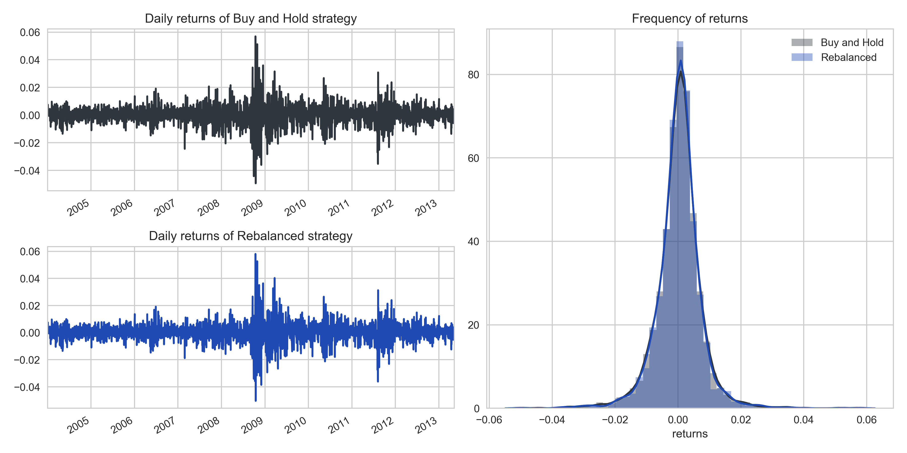
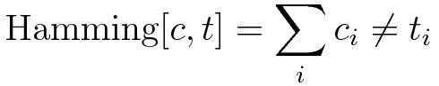

# BCS: Sebastian Rollen
---
## Deliverables
* Daily portfolio returns, both as a graph and dataset:
  * The dataset is available for the buy-and-hold portfolio in `datasets/returns_buy_and_hold.csv` and for the
  rebalanced portfolio in `datasets/returns_rebalance.csv`.
  * The graph is available in `images/daily_returns.png`. It can also be viewed below:
  
* Daily portfolio values, both as a graph and dataset:
  * The dataset is available for the buy-and-hold portfolio in `datasets/values_buy_and_hold.csv` and for the
  rebalanced portfolio in `datasets/values_rebalance.csv`.
  * The graph is available in `images/values.png`. It can also be viewed below:  
  
* Daily asset allocations for both the 'no rebalancing' case, and your rebalanced portfolio (graph + dataset):
  * The dataset is available for the buy-and-hold portfolio in `datasets/allocations_buy_and_hold.csv` and for the
  rebalanced portfolio in `datasets/allocations_rebalance.csv`.
  * The graph is available in `images/asset_allocations.png`. It can also be viewed below:
  
* A list of rebalances, including amount rebalanced:
  * The dataset is avaiable in `datasets/trades.csv`. A chart of the net flows between ETFs can be found in
  `images/trades.png`. It can also be viewed below:
  
* A small comparison of performance under rebalancing or not:
  * A dataset of summary statistics has been caluclated and included. The dataset is available in `datasets/stats.csv`.
* Any other results you want to present:
  * TBD
---
## Installation
For this project, I've used Anaconda for my packet manager. The Anaconda environment is given in the
`environment.yml` file. To install,
1. Create the environment from the `environment.yml` file:  
```
conda env create -f environment.yml
```
2. Activate the new environment:
  * Windows: `activate BCS`
  * macOS and Linux: `source activate BCS`
---
## General comments regarding the case
### Choice of distance function and  tolerance threshold
I spent a lot of time considering how to decide what trigger function to use in determining whether the portfolio
has to be rebalanced or not.

In general, I approached the problem by considering the current portfolio allocation *c* and the target portfolio
allocation *t* as being two vectors in 8-dimensional space and then defining some sort of distance function to measure
the drift of the former from the latter. My first idea was to measure the distance between the two points using either
the Manhattan distance or Euclidian distance between these two points, i.e.,


The reason for me using these two distance functions is because I am familiar with their use in regressions as penalty
functions, where they are referred to as the L1 norm and L2 norm, respectively. I considered two scenarios:
1. We are underweight **EEM** by 2 percentage points, overweight **SHY** by 1 percentage point and overweight **VTI**
by one percentage point
2. We are underweight **EEM** by 2 percentage points and overweight **SHY** by 2 percentage points

In both of these scenarios, the Manhattan distance is equal (4 percentage points), but the Euclidian distance is
different (~2.5 percentage points and ~2.8 percentage points, respectively).
The Euclidian distance function thus penalizes some large deviations more harshly than several smaller deviations,
whereas the Manhattan distance treats these deviations equally.

At this point in my analysis, I noticed that the Manhattan distance and Euclidian distance functions are two specific
cases of a more general distance function, the Minkowski distance.


Specifically, the Minkowski distance is equal to the Manhattan distance when p = 1 and equal to the Euclidian distance
when p = 2.
With the Minkowski distance, we have an infinite amount of possible distance functions, each with differing properties.
As p approaches zero, we get increasingly close to the Hamming distance function:



With the Hamming distance, we penalize any deviation from the target both equally and harshly. This is one extreme of
the Minkowski distance. The otherextreme is reached as p approaches infinity, the Chebyshev distance:


The Chebyshev distance only considers the largest deviation, and thus does not penalize other deviations at all.

I would expect either of these two extremes to perform poorly as a rebalancing trigger, but for different reasons:
* The Hamming distance would signal for a rebalance as soon as the allocation of our portfolio changes by even a
fraction. This would require continuous rebalancing and be impossible to implement in practice. The large amount of
trades would also harm the portfolio due to commissions and slippage.
* With the Chebyshev portfolio, our whole allocation could differ from the target portfolio by an amount very close to
the threshold and not be triggered. This could cause the portfolio to stay in a detrimental allocation for much
longer than a portfolio with a lower Minkowski p-value.

In order to pick which Minkowski p-value to use for the trigger function, I made a small script to loop through 
different combinations of threshold and p-values. The results can be seen as a heatmap below:


Each cell in the heatmap gives the excess Sharpe ratio, in basis points, of a rebalancing portfolio over the Sharpe
ratio of the buy-and-hold-portfolio. Every rebalancing portfolio is constructed with a specific Minkowski p-value
and rebalancing threshold, which are given by the row and columns, respectively. For some portfolios, no trades other 
than the initial purchase was made, as the threshold for rebalancing was never reached. These portfolios are 
represented as blank spaces in the heatmap.  
In general, we find that the Sharpe ratio of a portfolio usually increases as the Minkowski p-value or threshold
increases. However, at some point these parameters become too 'loose', and the portfolio never rebalances. 
The overa