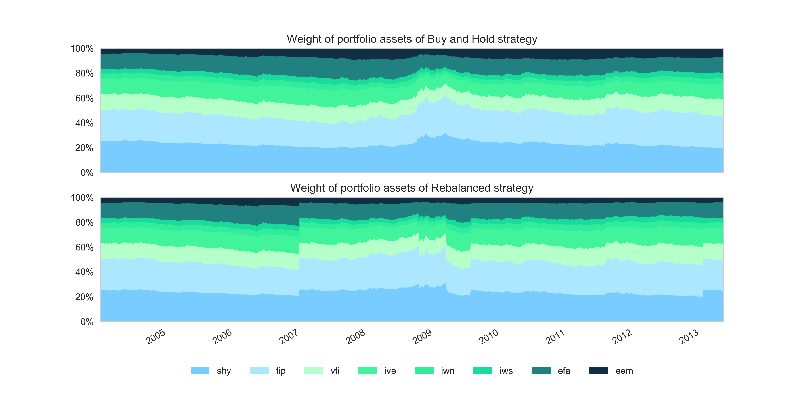
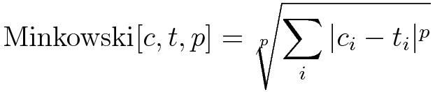
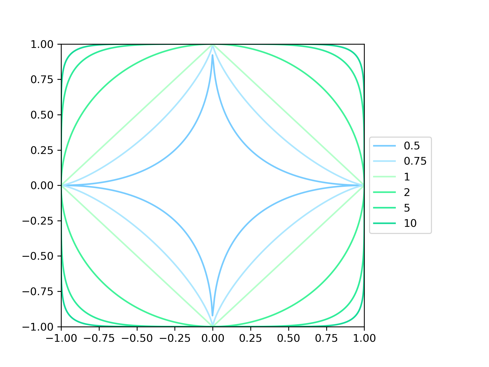

# Betterment Case Study: Sebastian Rollen

---
## Installation
For this project, I've used Anaconda for my packet manager. The Anaconda environment is given in the
`environment.yml` file. To install,
1. Create the environment from the `environment.yml` file:  
```conda env create -f environment.yml```
2. Activate the new environment:
  * Windows: `activate BCS`
  * macOS and Linux: `source activate BCS`  

The main portion of the case study is found in `main.py`, and can be run by calling `python main.py`.

---
## Deliverables
* Daily portfolio returns, both as a graph and dataset:
  * The dataset is available for the buy-and-hold portfolio in `datasets/buy_and_hold_returns.csv` and for the
  rebalanced portfolio in `datasets/rebalanced_returns.csv`.
  * The graph is available in `images/daily_returns.png`. It can also be viewed below:
  
* Daily portfolio values, both as a graph and dataset:
  * The dataset is available for the buy-and-hold portfolio in `datasets/buy_and_hold_values.csv` and for the
  rebalanced portfolio in `datasets/rebalanced_values.csv`.
  * The graph is available in `images/values.png`. It can also be viewed below:  
  
* Daily asset allocations for both the 'no rebalancing' case, and your rebalanced portfolio (graph + dataset):
  * The dataset is available for the buy-and-hold portfolio in `datasets/buy_and_hold_allocations.csv` and for the
  rebalanced portfolio in `datasets/rebalanced_allocations.csv`.
  * The graph is available in `images/asset_allocations.png`. It can also be viewed below:
  
* A list of rebalances, including amount rebalanced:
  * The dataset is available in `datasets/rebalanced_trades.csv`. A chart of the net flows between ETFs can be found in
  `images/trades.png`. It can also be viewed below:
  
* A small comparison of performance under rebalancing or not:
  * A dataset of summary statistics has been calculated and included. The dataset is available in `datasets/stats.csv`.
* Any other results you want to present:
  * Presented in rest of README
---
## General comments regarding the case
### Choice of distance function and  tolerance threshold
I spent a lot of time considering how to decide what trigger function to use in determining whether the portfolio
has to be rebalanced or not.

In general, I approached the problem by considering the current portfolio allocation *c* and the target portfolio
allocation *t* as being two vectors in 8-dimensional space and then defining some sort of distance function to measure
the drift of the former from the latter. My first idea was to measure the distance between the two points using either
the Manhattan distance or Euclidian distance between these two points, i.e.,


The reason for me using these two distance functions is because I am familiar with their use in regressions as penalty
functions, where they are referred to as the L1 norm and L2 norm, respectively. I considered two scenarios:
1. We are underweight **EEM** by 2 percentage points, overweight **SHY** by 1 percentage point and overweight **VTI**
by one percentage point
2. We are underweight **EEM** by 2 percentage points and overweight **SHY** by 2 percentage points

In both of these scenarios, the Manhattan distance is equal (4 percentage points), but the Euclidian distance is
different (~2.5 percentage points and ~2.8 percentage points, respectively).
The Euclidian distance function thus penalizes some large deviations more harshly than several smaller deviations,
whereas the Manhattan distance treats these deviations equally.

At this point in my analysis, I noticed that the Manhattan distance and Euclidian distance functions are two specific
cases of a more general distance function, the Minkowski distance.



Specifically, the Minkowski distance is equal to the Manhattan distance when p = 1 and equal to the Euclidian distance
when p = 2.
With the Minkowski distance, we have an infinite amount of possible distance functions, each with differing properties.
One can visualize the Minkowski distance in 2 dimensions by drawing the unit circle for that particular metric. 
The unit circle is defined as the boundary around the origin with all points on the circle being 1 distance unit away
from the origin. The unit circle was calculated for various Minkowski p values in 
`miscellaneous/minkowski_unit_circle.py` and is reproduced below:



For p = 2, we see a round circle as we would expect to see when visualizing the unit circle. That's because the 
Euclidian metric is used to measure distances in Euclidian 2-d space.  
For p = 1, the unit circle appears as a diamond inscribed in the p=2 circle. 

As p approaches zero, we get increasingly close to the Hamming distance function:


With the Hamming distance, we penalize any deviation from the target both equally and harshly. This is one extreme of
the Minkowski distance. The other extreme is reached as p approaches infinity, the Chebyshev distance:


The Chebyshev distance only considers the largest deviation, and thus does not penalize other deviations at all.

I would expect either of these two extremes to perform poorly as a rebalancing trigger, but for different reasons:
* The Hamming distance would signal for a rebalance as soon as the allocation of our portfolio changes by even a
fraction. This would require continuous rebalancing and be impossible to implement in practice. The large amount of
trades would also harm the portfolio due to commissions and slippage.
* With the Chebyshev portfolio, our whole allocation could differ from the target portfolio by an amount very close to
the threshold and not be triggered. This could cause the portfolio to stay in a detrimental allocation for much
longer than a portfolio with a lower Minkowski p-value.

In order to pick which Minkowski p-value to use for the trigger function, I made a small script 
(`miscellaneous/generate_heatmap.py`) to loop through different combinations of threshold and p-values. The results 
can be seen as a heatmap below:


Each cell in the heatmap gives the excess Sharpe ratio, in basis points, of a rebalancing portfolio over the Sharpe
ratio of the buy-and-hold-portfolio. Every rebalancing portfolio is constructed with a specific Minkowski p-value
and rebalancing threshold, which are given by the row and columns, respectively. For some portfolios, no trades other 
than the initial purchase was made, as the threshold for rebalancing was never reached. These portfolios are 
represented as blank spaces in the heatmap.  
In general, we find that the Sharpe ratio of a portfolio usually increases as the Minkowski p-value or threshold
increases. However, at some point these parameters become too 'loose', and the portfolio never rebalances. 
The overall maximum over the searched grid occurs at p=1 and tolerance=0.19. However, this seems like an unwise
choice of parameters since it is very near other cells that didn't trade at all. If we performed a backtest on a
different dataset, that particular portfolio may not rebalance at all.
In order to pick a more stable point of parameters, we calculate the neighborhood Sharpe ratios for each cell. The
neighborhood Sharpe ratios are defined as the average excess Sharpe ratios of each cell and its neighbors. By
computing this value, we find cells that have high excess Sharpe ratios, and also have neighbors with high Sharpe
ratios. This gives us more comfort that the parameters picked are stable for different inputs. The heatmap for the
neighborhood Sharpe ratios can be viewed below:


In this chart, we see that the largest neighborhood Sharpe ratio is found for the parameters p=4 and tolerance=0.06.
For this reason, these are the parameters that I ended up using during the main portion of the case study.

From the statistics dataset generated, we find that rebalancing of the portfolio increased our annualized returns
from 5.6% to 6.6% over the timeframe of the backtest. As such, my estimate of the value of rebalancing is around 1
percentage point per year.  
Additionally, the annualized volatility of the rebalanced portfolio is lower than that of the buy-and-hold portfolio.
This means that the Sharpe ratio of the rebalanced portfolio is significantly higher for the rebalanced portfolio, at
0.578 versus the 0.484 of the buy-and-hold portfolio.
---
### Assumptions of the model
#### Commissions / trading costs
The default commission applied in the model is 0.5% of the amount traded for each trade. However, if the trading 
strategy was applied in practice, there are other costs such as slippage that may apply. To make the model more 
realistic, one could increase the commission cost in the model, but a more realistic trading model would model 
slippage more explicitly.

#### Time of trades
In this model, each trade is made at the end of the trading day, based on the signal given from the previous trading
day. For example, if the portfolio allocation drifts above the threshold on day i, the model is rebalanced at the 
close of trading day i + 1.  
The assumption that the model is rebalanced at the end of the day is a common assumption for backtests, but a more 
accurate model would look at the volume traded per day and model trading throughout the day.

#### Use of cash
Since the input to the model only included returns and not asset prices, I assumed that I was able to buy fractional
shares and thus invest all cash at every time point. 

#### Tax considerations
The model does not take taxable gains or losses into account at all when trading. This is a very flawed assumption
as the rebalancing portfolio's returns could be significantly reduced on a post-tax basis, especially if it incurs
short-term gains.

#### Improvements that could be made to the method of rebalancing
The model only rebalances based on the Minkowski distance trigger function, but the model could be improved by 
considering the flow of cash through dividends. If a dividend is distributed, the model could use that added cash
as a means to rebalance the portfolio even if the threshold for rebalancing hasn't been breached. 
